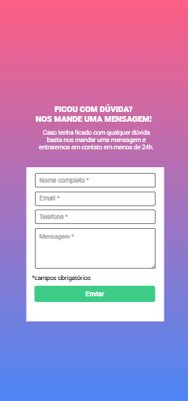

# Projeto FORMULÁRIO DE VALIDAÇÃO.

## Descrição 📝
Mais um projeto utilizando javascript. O desafio é criar uma Landing Page com um formulário de inscrição. Esse formuário deve ser interativo.   

Os usuários devem ser capazes de:

- Ver o layout ideal da página, independente do aparelho que estiver usando, sendo responsivo.

- Ao enviar o fórmulário caso as abas não estiverem preenchidas, devem ficar vermelhas, além de exibir a informação de obrigatório.

- Quando enviar o fórmulário, com as abas preenchidas, deve validar o envio, deixando as abas na cor verde. 

💻- Imagem do projeto em desktop.

[]

📱- Visualização projeto em mobile.

[]

## Meus desafios no processo. 🤯
A realização do projeto foi bem tranquila, acredito já ter dominado a estrutura HTML, e as estilizações no CSS estão cada vez mais compreensíveis, e a utilização da lógica de programação no JS, consigo entender melhor, na prática é bem mais fácil de entender, ainda assim, tem pontos a trabalhar para melhorar, preciso compreender melhor uso do forEach e a atribuição de valores e parâmetros. 

Também fui além e coloquei uma máscara no input "fone", estudei um pouco e consegui um bom resultado.

Grato!😊

## Como Utilizar. 👨‍💻

Clone com o projeto:
```
git clone https://github.com/HenryRomao/PROJ.FORMULARIO-DE-VALIDACAO.git
```

Acesse a pasta do projeto:
```
cd PROJ.FORMULARIO-DE-VALIDACAO
```

Bom estudo. 🍀

## Tecnologias utilizadas. 
- HTML
- CSS
- JAVASCRIPT